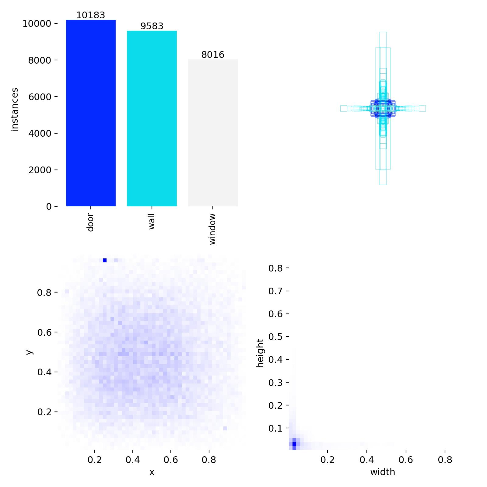
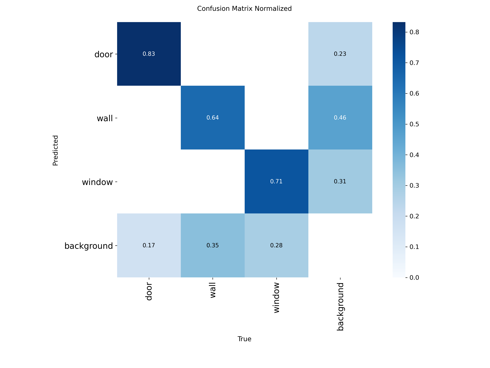
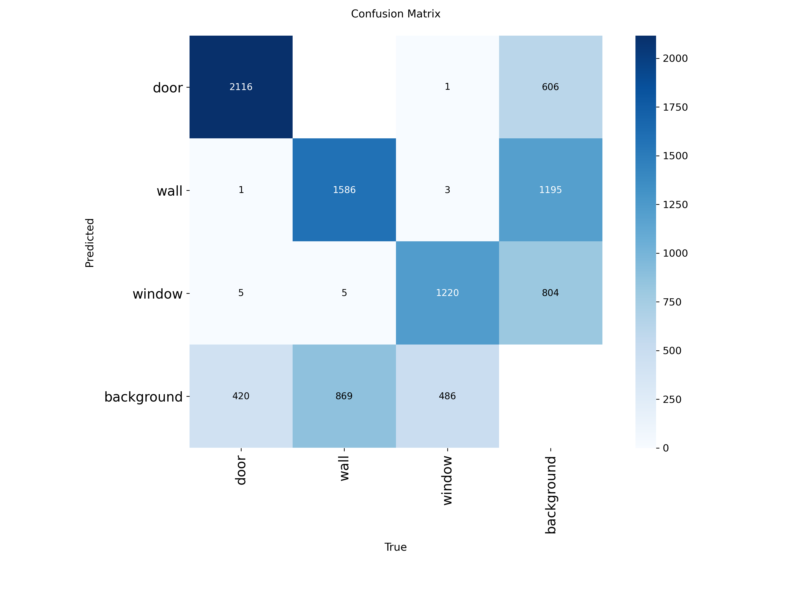

# Computer Vision Blueprint: Wall Detection

## Description

A YOLO-style computer vision training notebook with Roboflow dataset loading, training output plots, confusion matrices, and validation prediction images.

## Key Features

- Roboflow dataset download workflow
- Medium-resolution object detection training notebook
- Training curves and confusion-matrix outputs
- Validation prediction images for visual inspection

## Tech Stack

- Python
- Jupyter Notebook
- Roboflow
- YOLO object detection
- Google Colab

## Installation

pip install roboflow ultralytics

## Usage

Open `Untitled27.ipynb` in Google Colab, configure your Roboflow key securely, and run the notebook cells in order.

## Screenshots

## License

No license file is currently included. Add a license before reusing, distributing, or publishing this project for public collaboration.

